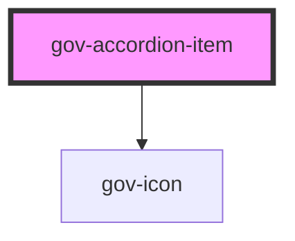

# gov-accordion-item

<!-- Auto Generated Below -->

## Properties

| Property     | Attribute     | Description                                                                                                                                                     | Type                                   | Default     |
| ------------ | ------------- | --------------------------------------------------------------------------------------------------------------------------------------------------------------- | -------------------------------------- | ----------- |
| `disabled`   | `disabled`    | Makes the button component disabled. This prevents users from being able to interact with the button, and conveys its inactive state to assistive technologies. | `boolean`                              | `false`     |
| `identifier` | `identifier`  | Custom accordion item identifier. Otherwise, it will be generated                                                                                               | `string`                               | `undefined` |
| `isExpanded` | `is-expanded` | Defines whether the accordion is open or closed by button                                                                                                       | `boolean`                              | `false`     |
| `size`       | `size`        | Accordion’s size.                                                                                                                                               | `"l" \| "m" \| "s" \| "xs"`            | `undefined` |
| `variant`    | `variant`     | Style variation of the button.                                                                                                                                  | `"custom" \| "primary" \| "secondary"` | `undefined` |

## Events

| Event        | Description                             | Type                              |
| ------------ | --------------------------------------- | --------------------------------- |
| `gov-change` | Called when the accordion state changes | `CustomEvent<AccordionItemEvent>` |

## Methods

### `close() => Promise<void>`

Closing the accordion

#### Returns

Type: `Promise<void>`

### `currentState() => Promise<boolean>`

Returns the current state of the component

#### Returns

Type: `Promise<boolean>`

### `open() => Promise<void>`

Opening the accordion

#### Returns

Type: `Promise<void>`

### `toggle() => Promise<void>`

Accordion switch

#### Returns

Type: `Promise<void>`

## Dependencies

### Depends on

- [gov-icon](../gov-icon)

### Graph

----------------------------------------------

*Built with [StencilJS](https://stenciljs.com/)*
