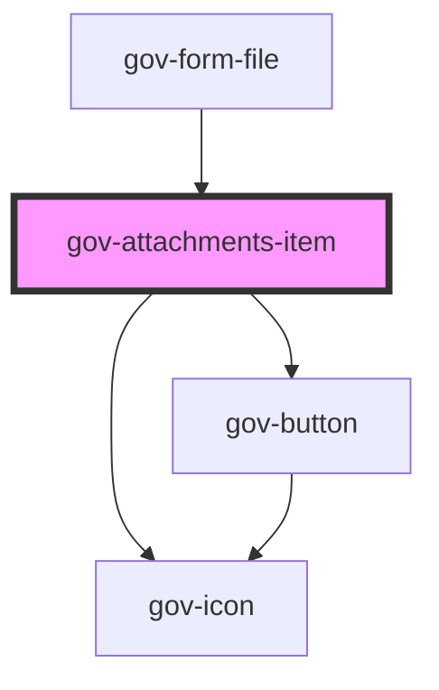

# gov-attachment

<!-- Auto Generated Below -->

## Properties

| Property               | Attribute                 | Description                                                                        | Type     | Default     |
| ---------------------- | ------------------------- | ---------------------------------------------------------------------------------- | -------- | ----------- |
| `wcagRemoveLabel`      | `wcag-remove-label`       | Adds accessible label for the remove button that is only shown for screen readers. | `string` | `undefined` |
| `wcagRemoveLabelledBy` | `wcag-remove-labelled-by` | Indicates the id of a component that labels the remove button.                     | `string` | `undefined` |

## Events

| Event        | Description                      | Type                        |
| ------------ | -------------------------------- | --------------------------- |
| `gov-remove` | Emitted when the file is removed | `CustomEvent<PointerEvent>` |

## Methods

### `validateWcag() => Promise<void>`

Validate the WCAG attributes of the component

#### Returns

Type: `Promise<void>`

## Dependencies

### Used by

 - [gov-form-file](../gov-form/file)

### Depends on

- [gov-button](../gov-button/button)
- [gov-icon](../gov-icon)

### Graph

----------------------------------------------

*Built with [StencilJS](https://stenciljs.com/)*
