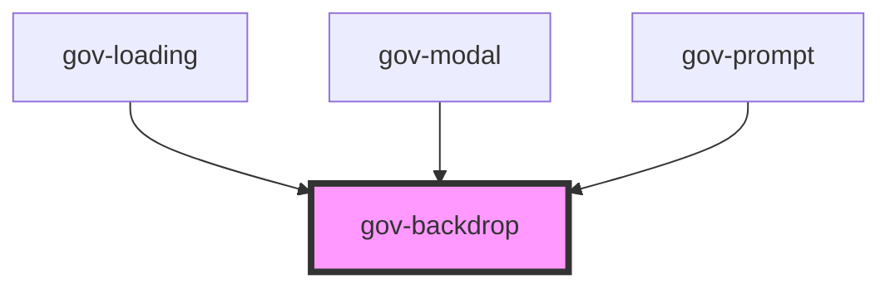

# gov-backdrop

<!-- Auto Generated Below -->

## Properties

| Property         | Attribute          | Description                                                                      | Type      | Default     |
| ---------------- | ------------------ | -------------------------------------------------------------------------------- | --------- | ----------- |
| `inverse`        | `inverse`          | Determine if component should have inverse colors to be used on dark background. | `boolean` | `false`     |
| `wcagLabel`      | `wcag-label`       | Adds accessible label for the backdrop that is only shown for screen readers.    | `string`  | `undefined` |
| `wcagLabelledBy` | `wcag-labelled-by` | String of id's that indicate alternative labels elements                         | `string`  | `undefined` |

## Events

| Event       | Description                 | Type                      |
| ----------- | --------------------------- | ------------------------- |
| `gov-click` | Emitted when button clicks. | `CustomEvent<MouseEvent>` |

## Methods

### `validateWcag() => Promise<void>`

Validate the WCAG attributes of the component

#### Returns

Type: `Promise<void>`

## Dependencies

### Used by

 - [gov-loading](../gov-loading/loading)
 - [gov-modal](../gov-modal)
 - [gov-prompt](../gov-promp)

### Graph

----------------------------------------------

*Built with [StencilJS](https://stenciljs.com/)*
