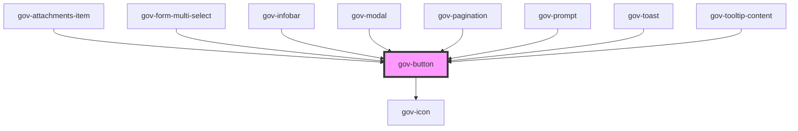

# gov-button

<!-- Auto Generated Below -->

## Properties

| Property               | Attribute                | Description                                                                                                                                                                                                                      | Type                                                            | Default     |
| ---------------------- | ------------------------ | -------------------------------------------------------------------------------------------------------------------------------------------------------------------------------------------------------------------------------- | --------------------------------------------------------------- | ----------- |
| `disabled`             | `disabled`               | Makes the button component disabled. This prevents users from being able to interact with the button, and conveys its inactive state to assistive technologies                                                                   | `boolean`                                                       | `false`     |
| `download`             | `download`               | Same as original parameter                                                                                                                                                                                                       | `boolean`                                                       | `undefined` |
| `expanded`             | `expanded`               | Expands the button to fill 100% of the container width                                                                                                                                                                           | `boolean`                                                       | `false`     |
| `focusable`            | `focusable`              | Same as original parameter                                                                                                                                                                                                       | `boolean`                                                       | `true`      |
| `href`                 | `href`                   | Same as original parameter                                                                                                                                                                                                       | `string`                                                        | `undefined` |
| `hreflang`             | `hreflang`               | Same as original parameter                                                                                                                                                                                                       | `string`                                                        | `undefined` |
| `iconLeft`             | `icon-left`              | Definition of the button icon on the left. The icon must be defined in the form "type/name".                                                                                                                                     | `string`                                                        | `undefined` |
| `iconRight`            | `icon-right`             | Definition of the button icon on the left. The icon must be defined in the form "type/name".                                                                                                                                     | `string`                                                        | `undefined` |
| `identifier`           | `identifier`             | Custom button identifier                                                                                                                                                                                                         | `string`                                                        | `undefined` |
| `inverse`              | `inverse`                | Determine if component should have inversed colors to be used on dark background                                                                                                                                                 | `boolean`                                                       | `false`     |
| `loading`              | `loading`                | Indicates whether an asynchronous process is running                                                                                                                                                                             | `string`                                                        | `undefined` |
| `name`                 | `name`                   | The name of the button, which gets paired with the button's value when submitted as part of a form. Corresponds with the native HTML name attribute                                                                              | `string`                                                        | `undefined` |
| `nativeType`           | `native-type`            | Same as original parameter https://developer.mozilla.org/en-US/docs/Web/HTML/Element/button#attr-type                                                                                                                            | `"button" \| "reset" \| "submit"`                               | `"button"`  |
| `referrerpolicy`       | `referrerpolicy`         | Same as original parameter                                                                                                                                                                                                       | `string`                                                        | `undefined` |
| `rel`                  | `rel`                    | Same as original parameter                                                                                                                                                                                                       | `string`                                                        | `undefined` |
| `size`                 | `size`                   | Button’s size                                                                                                                                                                                                                    | `"l" \| "m" \| "s" \| "xl" \| "xs"`                             | `"m"`       |
| `target`               | `target`                 | Same as original parameter                                                                                                                                                                                                       | `"_blank" \| "_new" \| "_self"`                                 | `undefined` |
| `type`                 | `type`                   | Button's type                                                                                                                                                                                                                    | `"base" \| "link" \| "outlined" \| "solid"`                     | `"solid"`   |
| `variant`              | `variant`                | Style variation of the button                                                                                                                                                                                                    | `"error" \| "primary" \| "secondary" \| "success" \| "warning"` | `undefined` |
| `wcagActiveDescendant` | `wcag-active-descendant` | Indicates the id of a related component’s visually focused element                                                                                                                                                               | `string`                                                        | `undefined` |
| `wcagControls`         | `wcag-controls`          | Use this property to add an aria-controls attribute to the button. Use the attribute to point to the unique id of the content that the button manages                                                                            | `string`                                                        | `undefined` |
| `wcagCurrent`          | `wcag-current`           | Indicates the current item within a container or set of related elements                                                                                                                                                         | `string`                                                        | `undefined` |
| `wcagDescribedBy`      | `wcag-described-by`      | Indicates the id of a component that describes the button                                                                                                                                                                        | `string`                                                        | `undefined` |
| `wcagDescription`      | `wcag-description`       | Aria description the button                                                                                                                                                                                                      | `string`                                                        | `undefined` |
| `wcagDetails`          | `wcag-details`           | Details of the component                                                                                                                                                                                                         | `string`                                                        | `undefined` |
| `wcagExpanded`         | `wcag-expanded`          | If a button expands or collapses adjacent content, then use the ariaExpanded prop to add the aria-expanded attribute to the button Set the value to convey the current expanded (true) or collapsed (false) state of the content | `boolean`                                                       | `undefined` |
| `wcagHasPopup`         | `wcag-has-popup`         | Use this property to add an aria-haspopup attribute to a button, if you are using it as a menu button                                                                                                                            | `string`                                                        | `undefined` |
| `wcagLabel`            | `wcag-label`             | Adds accessible label for the button that is only shown for screen readers Typically, this label text replaces the visible text on the button for users who use assistive technology                                             | `string`                                                        | `undefined` |
| `wcagLabelledBy`       | `wcag-labelled-by`       | String of id's that indicate alternative labels elements                                                                                                                                                                         | `string`                                                        | `undefined` |
| `wcagOwns`             | `wcag-owns`              | Indicates the id of a component owned by the button                                                                                                                                                                              | `string`                                                        | `undefined` |
| `wcagPressed`          | `wcag-pressed`           | Tells screen reader the element is pressed                                                                                                                                                                                       | `string`                                                        | `undefined` |

## Events

| Event       | Description                         | Type                       |
| ----------- | ----------------------------------- | -------------------------- |
| `gov-blur`  | Emitted when the button loses focus | `CustomEvent<ButtonEvent>` |
| `gov-click` | Emitted when the button click       | `CustomEvent<ButtonEvent>` |
| `gov-focus` | Emitted when the button has focus   | `CustomEvent<ButtonEvent>` |

## Methods

### `getTriggerRef() => Promise<HTMLLinkElement | HTMLButtonElement>`

Returns a clickable element instance

#### Returns

Type: `Promise<HTMLLinkElement | HTMLButtonElement>`

### `setFocus() => Promise<void>`

Focus button element

#### Returns

Type: `Promise<void>`

### `validateWcag() => Promise<void>`

Validate the WCAG attributes of the component

#### Returns

Type: `Promise<void>`

## Dependencies

### Used by

 - [gov-attachments-item](../../gov-attachments)
 - [gov-form-multi-select](../../gov-form/multiselect)
 - [gov-infobar](../../gov-infobar)
 - [gov-modal](../../gov-modal)
 - [gov-pagination](../../gov-pagination)
 - [gov-prompt](../../gov-promp)
 - [gov-toast](../../gov-toast)
 - [gov-tooltip-content](../../gov-tooltip)

### Depends on

- [gov-icon](../../gov-icon)

### Graph

----------------------------------------------

*Built with [StencilJS](https://stenciljs.com/)*
