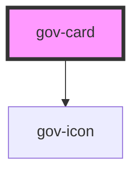

# gov-card

<!-- Auto Generated Below -->

## Properties

| Property                | Attribute                  | Description                                                                             | Type      | Default     |
| ----------------------- | -------------------------- | --------------------------------------------------------------------------------------- | --------- | ----------- |
| `collapsible`           | `collapsible`              | Defines wether the card can be collapsible                                              | `boolean` | `false`     |
| `expanded`              | `expanded`                 | Defines whether the card is open or closed by button                                    | `boolean` | `false`     |
| `headlineTag`           | `headline-tag`             | Used to change the HMTL tag in the card headline for correct semantic structure         | `string`  | `'h3'`      |
| `label`                 | `label`                    | Item label of the card                                                                  | `string`  | `undefined` |
| `promotion`             | `promotion`                | Style variation of the card.                                                            | `boolean` | `false`     |
| `wcagTriggerLabel`      | `wcag-trigger-label`       | Adds accessible label for the collapsible button that is only shown for screen readers. | `string`  | `undefined` |
| `wcagTriggerLabelledBy` | `wcag-trigger-labelled-by` | A string of identifiers that indicate alternative label elements for collapsible card   | `string`  | `undefined` |

## Events

| Event        | Description                               | Type                              |
| ------------ | ----------------------------------------- | --------------------------------- |
| `gov-toggle` | Called when the card toggle state changes | `CustomEvent<GovCardChangeEvent>` |

## Methods

### `close() => Promise<void>`

Close the card if it is collapsible

#### Returns

Type: `Promise<void>`

### `open() => Promise<void>`

Open the card if it is collapsible

#### Returns

Type: `Promise<void>`

### `validateWcag() => Promise<void>`

Validate the WCAG attributes of the component

#### Returns

Type: `Promise<void>`

## Dependencies

### Depends on

- [gov-icon](../gov-icon)

### Graph

----------------------------------------------

*Built with [StencilJS](https://stenciljs.com/)*
