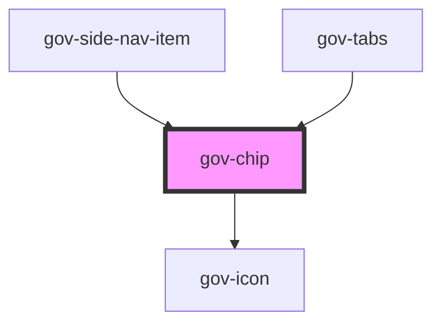

# gov-chip

<!-- Auto Generated Below -->

## Properties

| Property       | Attribute       | Description                                                                                                                                                                            | Type                                                            | Default                  |
| -------------- | --------------- | -------------------------------------------------------------------------------------------------------------------------------------------------------------------------------------- | --------------------------------------------------------------- | ------------------------ |
| `disabled`     | `disabled`      | Makes the chip component disabled. This prevents users from being able to interact with the button, and conveys its inactive state to assistive technologies.                          | `boolean`                                                       | `false`                  |
| `focusable`    | `focusable`     | Same as original parameter                                                                                                                                                             | `boolean`                                                       | `true`                   |
| `href`         | `href`          | Same as original parameter                                                                                                                                                             | `string`                                                        | `undefined`              |
| `iconLeft`     | `icon-left`     | Definition of the button icon on the left. The icon must be defined in the form "type/name".                                                                                           | `string`                                                        | `undefined`              |
| `iconRight`    | `icon-right`    | Definition of the button icon on the left. The icon must be defined in the form "type/name".                                                                                           | `string`                                                        | `undefined`              |
| `identifier`   | `identifier`    | Custom chip identifier. Otherwise, it will be generated                                                                                                                                | `string`                                                        | `undefined`              |
| `inverse`      | `inverse`       | Determine if component should have inverse colors to be used on dark background                                                                                                        | `boolean`                                                       | `false`                  |
| `size`         | `size`          | Chip’s size.                                                                                                                                                                           | `"l" \| "m" \| "s" \| "xl" \| "xs"`                             | `ButtonSizes._M`         |
| `tag`          | `tag`           | Used to change the HTML tag in the chip                                                                                                                                                | `"a" \| "button" \| "span"`                                     | `"span"`                 |
| `target`       | `target`        | Same as original parameter                                                                                                                                                             | `string`                                                        | `undefined`              |
| `variant`      | `variant`       | Style variation of the chip.                                                                                                                                                           | `"error" \| "primary" \| "secondary" \| "success" \| "warning"` | `ButtonVariants.PRIMARY` |
| `wcagControls` | `wcag-controls` | Use this property to add an aria-controls attribute to the button. Use the attribute to point to the unique id of the content that the button manages                                  | `string`                                                        | `undefined`              |
| `wcagLabel`    | `wcag-label`    | Adds accessible label for the button that is only shown for screen readers. Typically, this label text replaces the visible text on the button for users who use assistive technology. | `string`                                                        | `undefined`              |
| `wcagSelected` | `wcag-selected` | Same as original parameter                                                                                                                                                             | `boolean`                                                       | `undefined`              |

## Events

| Event       | Description                    | Type                        |
| ----------- | ------------------------------ | --------------------------- |
| `gov-click` | Emitted when the button click. | `CustomEvent<PointerEvent>` |

## Methods

### `getTriggerIdentifier() => Promise<string>`

Returns a unique tab trigger identifier

#### Returns

Type: `Promise<string>`

### `getTriggerRef() => Promise<HTMLLinkElement | HTMLButtonElement | HTMLSpanElement>`

Returns a clickable element instance

#### Returns

Type: `Promise<HTMLLinkElement | HTMLButtonElement | HTMLSpanElement>`

### `setFocus() => Promise<void>`

Focus button element

#### Returns

Type: `Promise<void>`

## Dependencies

### Used by

 - [gov-side-nav-item](../gov-side-nav)
 - [gov-tabs](../gov-tabs)

### Depends on

- [gov-icon](../gov-icon)

### Graph

----------------------------------------------

*Built with [StencilJS](https://stenciljs.com/)*
