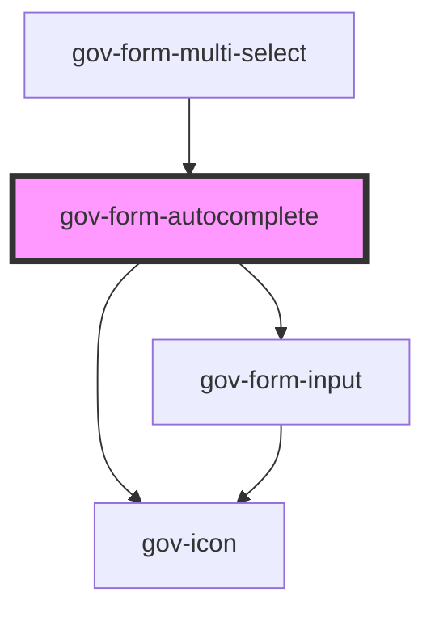

# gov-form-autocomplete

<!-- Auto Generated Below -->

## Properties

| Property          | Attribute           | Description                                                                                                                                                                                                                                                                                        | Type                       | Default                            |
| ----------------- | ------------------- | -------------------------------------------------------------------------------------------------------------------------------------------------------------------------------------------------------------------------------------------------------------------------------------------------- | -------------------------- | ---------------------------------- |
| `disabled`        | `disabled`          | Makes the input component disabled. This prevents users from being able to interact with the select, and conveys its inactive state to assistive technologies.                                                                                                                                     | `boolean`                  | `false`                            |
| `identifier`      | `identifier`        | Custom input identifier.                                                                                                                                                                                                                                                                           | `string`                   | `undefined`                        |
| `invalid`         | `invalid`           | Indicates the entered value does not conform to the format expected by the application.                                                                                                                                                                                                            | `boolean`                  | `undefined`                        |
| `maxlength`       | `maxlength`         | Maximum length (number of characters) of value                                                                                                                                                                                                                                                     | `number`                   | `undefined`                        |
| `messageEmpty`    | `message-empty`     | Custom message for when there is a blank sheet                                                                                                                                                                                                                                                     | `string`                   | `'Nebyly nalezeny žádné výsledky'` |
| `messageLoading`  | `message-loading`   | Custom message for when data is loaded                                                                                                                                                                                                                                                             | `string`                   | `'Načítám...'`                     |
| `minlength`       | `minlength`         | Minimum length (number of characters) of value                                                                                                                                                                                                                                                     | `number`                   | `3`                                |
| `name`            | `name`              | Name of the input.                                                                                                                                                                                                                                                                                 | `string`                   | `undefined`                        |
| `nameKey`         | `name-key`          | Main key name in the object                                                                                                                                                                                                                                                                        | `string`                   | `'name'`                           |
| `placeholder`     | `placeholder`       | Text that appears in the form control when it has no value set                                                                                                                                                                                                                                     | `string`                   | `undefined`                        |
| `readonly`        | `readonly`          | The value is not editable                                                                                                                                                                                                                                                                          | `boolean`                  | `undefined`                        |
| `required`        | `required`          | Set whether the input is required or not. Please note that this is necessary for accessible inputs when the user is required to fill them. When using this property you need to also set “novalidate” attribute to your form element to prevent browser from displaying its own validation errors. | `boolean`                  | `false`                            |
| `size`            | `size`              | Input’s size.                                                                                                                                                                                                                                                                                      | `"l" \| "m" \| "xl"`       | `'m'`                              |
| `success`         | `success`           | Indicates the entered value of child form element does conform to the format expected by the application.                                                                                                                                                                                          | `boolean`                  | `undefined`                        |
| `value`           | `value`             | Value of input                                                                                                                                                                                                                                                                                     | `string`                   | `''`                               |
| `variant`         | `variant`           | Style variation of the form input.                                                                                                                                                                                                                                                                 | `"primary" \| "secondary"` | `undefined`                        |
| `wcagDescribedBy` | `wcag-described-by` | Indicates the id of a component that describes the input.                                                                                                                                                                                                                                          | `string`                   | `undefined`                        |
| `wcagLabelledBy`  | `wcag-labelled-by`  | Indicates the id of a component that labels the input.                                                                                                                                                                                                                                             | `string`                   | `undefined`                        |
| `wcagOwns`        | `wcag-owns`         | Same as original parameter https://developer.mozilla.org/en-US/docs/Web/Accessibility/ARIA/Attributes/aria-owns                                                                                                                                                                                    | `string`                   | `undefined`                        |

## Events

| Event        | Description                          | Type                                 |
| ------------ | ------------------------------------ | ------------------------------------ |
| `gov-blur`   | Emitted when the input loses focus.  | `CustomEvent<FormAutocompleteEvent>` |
| `gov-focus`  | Emitted when the input has focus.    | `CustomEvent<FormAutocompleteEvent>` |
| `gov-input`  | Emitted when the input change value. | `CustomEvent<FormAutocompleteEvent>` |
| `gov-select` | Emitted when the input change value. | `CustomEvent<FormAutocompleteEvent>` |

## Methods

### `clearValue() => Promise<void>`

Clears whisperer value

#### Returns

Type: `Promise<void>`

### `setFocus(options?: FocusOptions) => Promise<void>`

Returns the current state of the component

#### Returns

Type: `Promise<void>`

### `setOptions(options: GovFormAutocompleteItem[]) => Promise<void>`

Set options for list

#### Returns

Type: `Promise<void>`

### `setProcessing(status: boolean) => Promise<void>`

Clears whisperer value

#### Returns

Type: `Promise<void>`

### `setSearchCallback(callback: (value: string) => Promise<any>) => Promise<void>`

Set a custom asynchronous function for the whisperer

#### Returns

Type: `Promise<void>`

### `setTemplateResolver(callback: (item: GovFormAutocompleteItem) => string) => Promise<void>`

Setting a custom whisper result template

#### Returns

Type: `Promise<void>`

## Dependencies

### Used by

 - [gov-form-multi-select](../multiselect)

### Depends on

- [gov-form-input](../input)
- [gov-icon](../../gov-icon)

### Graph

----------------------------------------------

*Built with [StencilJS](https://stenciljs.com/)*
