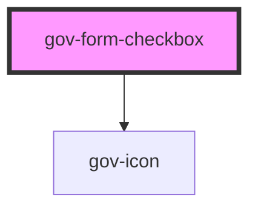

# gov-form-checkbox

<!-- Auto Generated Below -->

## Properties

| Property          | Attribute           | Description                                                                                                                                                                                                                                                                                        | Type                        | Default     |
| ----------------- | ------------------- | -------------------------------------------------------------------------------------------------------------------------------------------------------------------------------------------------------------------------------------------------------------------------------------------------- | --------------------------- | ----------- |
| `checked`         | `checked`           | Checkbox button state                                                                                                                                                                                                                                                                              | `boolean`                   | `false`     |
| `disabled`        | `disabled`          | Makes the checkbox component disabled. This prevents users from being able to interact with the checkbox, and conveys its inactive state to assistive technologies.                                                                                                                                | `boolean`                   | `false`     |
| `identifier`      | `identifier`        | Custom checkbox identifier.                                                                                                                                                                                                                                                                        | `string`                    | `undefined` |
| `invalid`         | `invalid`           | Indicates the entered value does not conform to the format expected by the application.                                                                                                                                                                                                            | `boolean`                   | `undefined` |
| `name`            | `name`              | Name of the checkbox.                                                                                                                                                                                                                                                                              | `string`                    | `undefined` |
| `noLabel`         | `no-label`          | When you can't use the form label.                                                                                                                                                                                                                                                                 | `boolean`                   | `false`     |
| `required`        | `required`          | Set whether the input is required or not. Please note that this is necessary for accessible inputs when the user is required to fill them. When using this property you need to also set “novalidate” attribute to your form element to prevent browser from displaying its own validation errors. | `boolean`                   | `false`     |
| `size`            | `size`              | Checkboxes size.                                                                                                                                                                                                                                                                                   | `"l" \| "m" \| "s" \| "xs"` | `"m"`       |
| `value`           | `value`             | Value of checkbox                                                                                                                                                                                                                                                                                  | `string`                    | `undefined` |
| `wcagDescribedBy` | `wcag-described-by` | Indicates the id of a component that describes the input.                                                                                                                                                                                                                                          | `string`                    | `undefined` |
| `wcagLabelledBy`  | `wcag-labelled-by`  | Indicates the id of a component that labels the input.                                                                                                                                                                                                                                             | `string`                    | `undefined` |

## Events

| Event        | Description                             | Type                             |
| ------------ | --------------------------------------- | -------------------------------- |
| `gov-blur`   | Emitted when the checkbox loses focus.  | `CustomEvent<FormCheckboxEvent>` |
| `gov-change` | Emitted when the checkbox change value. | `CustomEvent<FormCheckboxEvent>` |
| `gov-focus`  | Emitted when the checkbox has focus.    | `CustomEvent<FormCheckboxEvent>` |

## Methods

### `getRef() => Promise<HTMLInputElement>`

Returns the reference of the native element

#### Returns

Type: `Promise<HTMLInputElement>`

### `validateWcag() => Promise<void>`

Validate the WCAG attributes of the component

#### Returns

Type: `Promise<void>`

## Dependencies

### Depends on

- [gov-icon](../../gov-icon)

### Graph

----------------------------------------------

*Built with [StencilJS](https://stenciljs.com/)*
