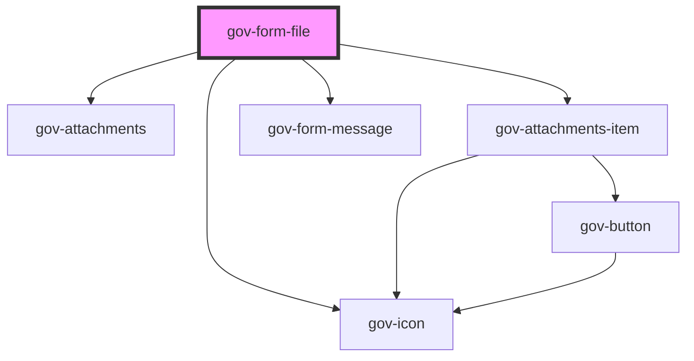

# gov-form-file

<!-- Auto Generated Below -->

## Properties

| Property               | Attribute                | Description                                                                                                                                                                                                                                                                                        | Type      | Default                                               |
| ---------------------- | ------------------------ | -------------------------------------------------------------------------------------------------------------------------------------------------------------------------------------------------------------------------------------------------------------------------------------------------- | --------- | ----------------------------------------------------- |
| `accept`               | `accept`                 | Same as original parameter                                                                                                                                                                                                                                                                         | `string`  | `undefined`                                           |
| `attachmentsLabel`     | `attachments-label`      | Description of the list of attachments                                                                                                                                                                                                                                                             | `string`  | `"Přílohy"`                                           |
| `disabled`             | `disabled`               | Makes the File component disabled. This prevents users from being able to interact with the File, and conveys its inactive state to assistive technologies.                                                                                                                                        | `boolean` | `false`                                               |
| `displayAttachments`   | `display-attachments`    | Show list of attachments                                                                                                                                                                                                                                                                           | `boolean` | `true`                                                |
| `errorAccept`          | `error-accept`           | Insert unsupported file error message                                                                                                                                                                                                                                                              | `string`  | `"Soubor tohoto typu není povolen"`                   |
| `errorSize`            | `error-size`             | Error message when the maximum file size is exceeded                                                                                                                                                                                                                                               | `string`  | `"Soubor je větší než povolená velikost {FILE_SIZE}"` |
| `expanded`             | `expanded`               | Expands the file input to fill 100% of the container width.                                                                                                                                                                                                                                        | `boolean` | `false`                                               |
| `identifier`           | `identifier`             | Custom File identifier.                                                                                                                                                                                                                                                                            | `string`  | `undefined`                                           |
| `invalid`              | `invalid`                | Indicates the entered value does not conform to the format expected by the application.                                                                                                                                                                                                            | `boolean` | `undefined`                                           |
| `maxFileSize`          | `max-file-size`          | Maximum embedded file size                                                                                                                                                                                                                                                                         | `number`  | `-1`                                                  |
| `multiple`             | `multiple`               | Same as original parameter                                                                                                                                                                                                                                                                         | `boolean` | `false`                                               |
| `name`                 | `name`                   | Name of the input.                                                                                                                                                                                                                                                                                 | `string`  | `undefined`                                           |
| `required`             | `required`               | Set whether the input is required or not. Please note that this is necessary for accessible inputs when the user is required to fill them. When using this property you need to also set “novalidate” attribute to your form element to prevent browser from displaying its own validation errors. | `boolean` | `false`                                               |
| `wcagAttachmentsLabel` | `wcag-attachments-label` | Adds accessible label for the list of attachments.                                                                                                                                                                                                                                                 | `string`  | `"Přílohy"`                                           |
| `wcagDescribedBy`      | `wcag-described-by`      | Indicates the id of a component that describes the input.                                                                                                                                                                                                                                          | `string`  | `undefined`                                           |
| `wcagLabelledBy`       | `wcag-labelled-by`       | Indicates the id of a component that labels the input.                                                                                                                                                                                                                                             | `string`  | `undefined`                                           |
| `wcagRemoveLabel`      | `wcag-remove-label`      | Adds accessible label for the remove button that is only shown for screen readers.                                                                                                                                                                                                                 | `string`  | `"Odebrat soubor {FILE_NAME}"`                        |

## Events

| Event             | Description                                       | Type                            |
| ----------------- | ------------------------------------------------- | ------------------------------- |
| `gov-add-file`    | Called when a new file is added                   | `CustomEvent<GovFormFileEvent>` |
| `gov-blur`        | Emitted when the File loses focus.                | `CustomEvent<GovFormFileEvent>` |
| `gov-files`       | Called when the list of inserted files is changed | `CustomEvent<GovFormFileEvent>` |
| `gov-focus`       | Emitted when the File has focus.                  | `CustomEvent<GovFormFileEvent>` |
| `gov-remove-file` | Called when a file is removed from the list       | `CustomEvent<GovFormFileEvent>` |

## Methods

### `getAreaRef() => Promise<HTMLDivElement>`

Returns the reference of the native area element

#### Returns

Type: `Promise<HTMLDivElement>`

### `getRef() => Promise<HTMLInputElement>`

Returns the reference of the native element

#### Returns

Type: `Promise<HTMLInputElement>`

### `reset() => Promise<void>`

Remove all files from component state

#### Returns

Type: `Promise<void>`

### `validateWcag() => Promise<void>`

Validate the WCAG attributes of the component

#### Returns

Type: `Promise<void>`

## Dependencies

### Depends on

- [gov-attachments](../../gov-attachments)
- [gov-attachments-item](../../gov-attachments)
- [gov-form-message](../message)
- [gov-icon](../../gov-icon)

### Graph

----------------------------------------------

*Built with [StencilJS](https://stenciljs.com/)*
