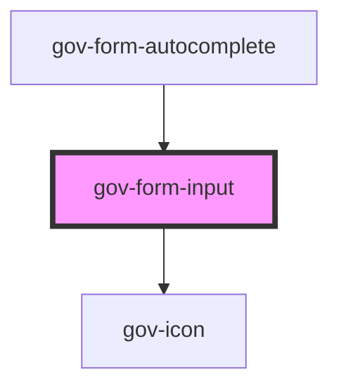

# gov-form-input

<!-- Auto Generated Below -->

## Properties

| Property           | Attribute           | Description                                                                                                                                                                                                                                                                                        | Type                                                                                                                                                | Default       |
| ------------------ | ------------------- | -------------------------------------------------------------------------------------------------------------------------------------------------------------------------------------------------------------------------------------------------------------------------------------------------- | --------------------------------------------------------------------------------------------------------------------------------------------------- | ------------- |
| `autocomplete`     | `autocomplete`      | Same as original parameter https://developer.mozilla.org/en-US/docs/Web/HTML/Element/textarea#attr-autocomplete                                                                                                                                                                                    | `boolean`                                                                                                                                           | `undefined`   |
| `autocorrect`      | `autocorrect`       | Same as original parameter https://developer.mozilla.org/en-US/docs/Web/HTML/Element/textarea#attr-autocorrect                                                                                                                                                                                     | `boolean`                                                                                                                                           | `undefined`   |
| `cols`             | `cols`              | Same as original parameter https://developer.mozilla.org/en-US/docs/Web/HTML/Element/textarea#attr-cols                                                                                                                                                                                            | `number`                                                                                                                                            | `undefined`   |
| `disabled`         | `disabled`          | Makes the input component disabled. This prevents users from being able to interact with the select, and conveys its inactive state to assistive technologies.                                                                                                                                     | `boolean`                                                                                                                                           | `false`       |
| `identifier`       | `identifier`        | Custom input identifier.                                                                                                                                                                                                                                                                           | `string`                                                                                                                                            | `undefined`   |
| `inputType`        | `input-type`        | Same as original parameter                                                                                                                                                                                                                                                                         | `"color" \| "date" \| "datetime-local" \| "email" \| "month" \| "number" \| "password" \| "search" \| "tel" \| "text" \| "time" \| "url" \| "week"` | `"text"`      |
| `invalid`          | `invalid`           | Indicates the entered value does not conform to the format expected by the application.                                                                                                                                                                                                            | `boolean`                                                                                                                                           | `undefined`   |
| `max`              | `max`               | Maximum value that is acceptable and valid for the input containing the attribute                                                                                                                                                                                                                  | `number \| string`                                                                                                                                  | `undefined`   |
| `maxlength`        | `maxlength`         | Maximum length (number of characters) of value                                                                                                                                                                                                                                                     | `number`                                                                                                                                            | `undefined`   |
| `min`              | `min`               | Minimum value that is acceptable and valid for the input containing the attribute                                                                                                                                                                                                                  | `number \| string`                                                                                                                                  | `undefined`   |
| `minlength`        | `minlength`         | Minimum length (number of characters) of value                                                                                                                                                                                                                                                     | `number`                                                                                                                                            | `undefined`   |
| `multiline`        | `multiline`         | Generates a texarea for the possibility of multiple lines                                                                                                                                                                                                                                          | `boolean`                                                                                                                                           | `undefined`   |
| `name`             | `name`              | Name of the input.                                                                                                                                                                                                                                                                                 | `string`                                                                                                                                            | `undefined`   |
| `placeholder`      | `placeholder`       | Text that appears in the form control when it has no value set                                                                                                                                                                                                                                     | `string`                                                                                                                                            | `undefined`   |
| `readonly`         | `readonly`          | The value is not editable                                                                                                                                                                                                                                                                          | `boolean`                                                                                                                                           | `undefined`   |
| `required`         | `required`          | Set whether the input is required or not. Please note that this is necessary for accessible inputs when the user is required to fill them. When using this property you need to also set “novalidate” attribute to your form element to prevent browser from displaying its own validation errors. | `boolean`                                                                                                                                           | `false`       |
| `role`             | `role`              | Same as original parameter                                                                                                                                                                                                                                                                         | `string`                                                                                                                                            | `undefined`   |
| `rows`             | `rows`              | Same as original parameter https://developer.mozilla.org/en-US/docs/Web/HTML/Element/textarea#attr-rows                                                                                                                                                                                            | `number`                                                                                                                                            | `undefined`   |
| `size`             | `size`              | Input’s size.                                                                                                                                                                                                                                                                                      | `"l" \| "m" \| "s" \| "xl"`                                                                                                                         | `"m"`         |
| `success`          | `success`           | Indicates the entered value of child form element does conform to the format expected by the application.                                                                                                                                                                                          | `boolean`                                                                                                                                           | `undefined`   |
| `type`             | `type`              | Defineds the visual style of input                                                                                                                                                                                                                                                                 | `Type`                                                                                                                                              | `undefined`   |
| `value`            | `value`             | Value of input                                                                                                                                                                                                                                                                                     | `string`                                                                                                                                            | `undefined`   |
| `variant`          | `variant`           | Style variation of the form input.                                                                                                                                                                                                                                                                 | `"primary" \| "secondary"`                                                                                                                          | `"secondary"` |
| `wcagAutocomplete` | `wcag-autocomplete` | Indicates whether inputting text could trigger display of one or more predictions of the user's intended value.                                                                                                                                                                                    | `string`                                                                                                                                            | `undefined`   |
| `wcagDescribedBy`  | `wcag-described-by` | Indicates the id of a component that describes the input.                                                                                                                                                                                                                                          | `string`                                                                                                                                            | `undefined`   |
| `wcagExpanded`     | `wcag-expanded`     | Attribute is set on an element to indicate if a control is expanded or collapsed                                                                                                                                                                                                                   | `boolean`                                                                                                                                           | `undefined`   |
| `wcagLabelledBy`   | `wcag-labelled-by`  | Indicates the id of a component that labels the input.                                                                                                                                                                                                                                             | `string`                                                                                                                                            | `undefined`   |
| `wcagOwns`         | `wcag-owns`         | Indicates the id of a component that describes the input.                                                                                                                                                                                                                                          | `string`                                                                                                                                            | `undefined`   |

## Events

| Event         | Description                          | Type                          |
| ------------- | ------------------------------------ | ----------------------------- |
| `gov-blur`    | Emitted when the input loses focus.  | `CustomEvent<FormInputEvent>` |
| `gov-focus`   | Emitted when the input has focus.    | `CustomEvent<FormInputEvent>` |
| `gov-input`   | Emitted when the input change value. | `CustomEvent<FormInputEvent>` |
| `gov-keydown` | Emitted when the input change value. | `CustomEvent<FormInputEvent>` |
| `gov-keyup`   | Emitted when the input change value. | `CustomEvent<FormInputEvent>` |

## Methods

### `clearValue() => Promise<void>`

Clears input value

#### Returns

Type: `Promise<void>`

### `getRef() => Promise<HTMLInputElement>`

Returns an instance of the native html input element

#### Returns

Type: `Promise<HTMLInputElement>`

### `setFocus(options?: FocusOptions) => Promise<void>`

Returns the current state of the component

#### Parameters

| Name      | Type           | Description |
| --------- | -------------- | ----------- |
| `options` | `FocusOptions` |             |

#### Returns

Type: `Promise<void>`

### `setValue(value: string) => Promise<void>`

Sets the ordered value of the element

#### Parameters

| Name    | Type     | Description |
| ------- | -------- | ----------- |
| `value` | `string` |             |

#### Returns

Type: `Promise<void>`

### `validateWcag() => Promise<void>`

Validate the WCAG attributes of the component

#### Returns

Type: `Promise<void>`

## Dependencies

### Used by

 - [gov-form-autocomplete](../autocomplete)

### Depends on

- [gov-icon](../../gov-icon)

### Graph

----------------------------------------------

*Built with [StencilJS](https://stenciljs.com/)*
