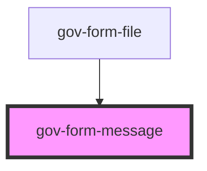

# gov-form-message

<!-- Auto Generated Below -->

## Properties

| Property  | Attribute | Description                     | Type                                               | Default       |
| --------- | --------- | ------------------------------- | -------------------------------------------------- | ------------- |
| `variant` | `variant` | Style variation of the message. | `"error" \| "secondary" \| "success" \| "warning"` | `'secondary'` |

## Methods

### `identifier() => Promise<string>`

Returns unique identfiier of message

#### Returns

Type: `Promise<string>`

## Dependencies

### Used by

 - [gov-form-file](../file)

### Graph

----------------------------------------------

*Built with [StencilJS](https://stenciljs.com/)*
