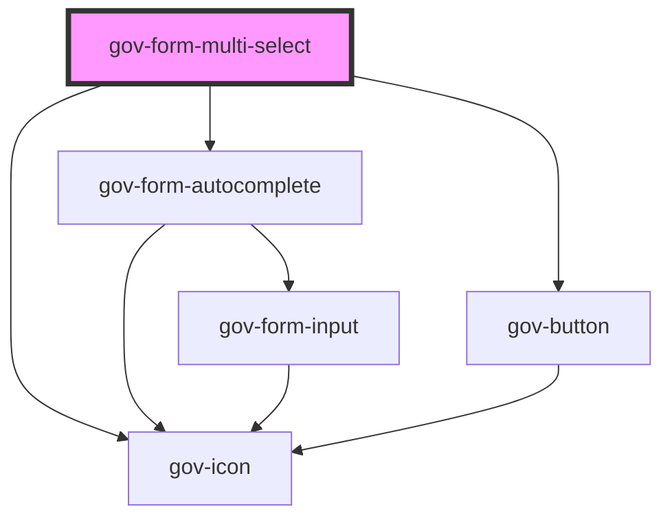

# gov-form-multi-select

<!-- Auto Generated Below -->

## Properties

| Property           | Attribute            | Description                                                                                                                                                                                                                                                                                        | Type                       | Default                            |
| ------------------ | -------------------- | -------------------------------------------------------------------------------------------------------------------------------------------------------------------------------------------------------------------------------------------------------------------------------------------------- | -------------------------- | ---------------------------------- |
| `disabled`         | `disabled`           | Makes the select component disabled. This prevents users from being able to interact with the select, and conveys its inactive state to assistive technologies.                                                                                                                                    | `boolean`                  | `false`                            |
| `hideSelectedList` | `hide-selected-list` | Option to hide the list of selected items                                                                                                                                                                                                                                                          | `boolean`                  | `false`                            |
| `identifier`       | `identifier`         | Custom select identifier.                                                                                                                                                                                                                                                                          | `string`                   | `undefined`                        |
| `invalid`          | `invalid`            | Indicates the entered value does not conform to the format expected by the application.                                                                                                                                                                                                            | `boolean`                  | `undefined`                        |
| `messageEmpty`     | `message-empty`      | Custom message for when there is a blank sheet                                                                                                                                                                                                                                                     | `string`                   | `'Nebyly nalezeny žádné výsledky'` |
| `messageLoading`   | `message-loading`    | Custom message for when data is loaded                                                                                                                                                                                                                                                             | `string`                   | `'Načítám...'`                     |
| `name`             | `name`               | Name of the select.                                                                                                                                                                                                                                                                                | `string`                   | `undefined`                        |
| `placeholder`      | `placeholder`        | Custom select placeholder.                                                                                                                                                                                                                                                                         | `string`                   | `undefined`                        |
| `required`         | `required`           | Set whether the input is required or not. Please note that this is necessary for accessible inputs when the user is required to fill them. When using this property you need to also set “novalidate” attribute to your form element to prevent browser from displaying its own validation errors. | `boolean`                  | `false`                            |
| `size`             | `size`               | Select’s size.                                                                                                                                                                                                                                                                                     | `"l" \| "m" \| "xl"`       | `'m'`                              |
| `success`          | `success`            | Indicates the entered value of child form element does conform to the format expected by the application.                                                                                                                                                                                          | `boolean`                  | `undefined`                        |
| `variant`          | `variant`            | Style variation of the form select.                                                                                                                                                                                                                                                                | `"primary" \| "secondary"` | `undefined`                        |
| `wcagDescribedBy`  | `wcag-described-by`  | Indicates the id of a component that describes the input.                                                                                                                                                                                                                                          | `string`                   | `undefined`                        |
| `wcagLabelledBy`   | `wcag-labelled-by`   | Indicates the id of a component that labels the input.                                                                                                                                                                                                                                             | `string`                   | `undefined`                        |
| `wcagOwns`         | `wcag-owns`          | Indicates the id of a component that describes the input.                                                                                                                                                                                                                                          | `string`                   | `undefined`                        |

## Events

| Event        | Description                           | Type                                |
| ------------ | ------------------------------------- | ----------------------------------- |
| `gov-blur`   | Emitted when the select loses focus.  | `CustomEvent<FormMultiselectEvent>` |
| `gov-change` | Emitted when the select change value. | `CustomEvent<FormMultiselectEvent>` |
| `gov-focus`  | Emitted when the select has focus.    | `CustomEvent<FormMultiselectEvent>` |
| `gov-remove` | Emitted when an item is removed       | `CustomEvent<FormMultiselectEvent>` |
| `gov-select` | Emitted when an item is selected      | `CustomEvent<FormMultiselectEvent>` |

## Methods

### `getRef() => Promise<HTMLSelectElement>`

Returns an instance of the native html select element

#### Returns

Type: `Promise<HTMLSelectElement>`

### `getSelectedOptions() => Promise<GovFormMultiSelectItem[]>`

Returns a list of selected items

#### Returns

Type: `Promise<GovFormMultiSelectItem[]>`

### `removeSelectedOption(option: GovFormMultiSelectItem, notify?: boolean) => Promise<void>`

To remove an option from the selected list

#### Returns

Type: `Promise<void>`

### `setFocus(options?: FocusOptions) => Promise<void>`

Returns the current state of the component

#### Returns

Type: `Promise<void>`

### `setOptions(options: GovFormMultiSelectItem[]) => Promise<void>`

Setting a list of options to choose from

#### Returns

Type: `Promise<void>`

### `setSelectedOption(option: GovFormMultiSelectItem, notify?: boolean) => Promise<void>`

Returns an instance of the native html select element

#### Returns

Type: `Promise<void>`

### `setSelectedOptions(options: GovFormMultiSelectItem[]) => Promise<void>`

Setting the list of selected options

#### Returns

Type: `Promise<void>`

### `setValue(value: string) => Promise<void>`

Sets the ordered value of the element

#### Returns

Type: `Promise<void>`

### `validateWcag() => Promise<void>`

Validate the WCAG attributes of the component

#### Returns

Type: `Promise<void>`

## Dependencies

### Depends on

- [gov-form-autocomplete](../autocomplete)
- [gov-icon](../../gov-icon)
- [gov-button](../../gov-button/button)

### Graph

----------------------------------------------

*Built with [StencilJS](https://stenciljs.com/)*
