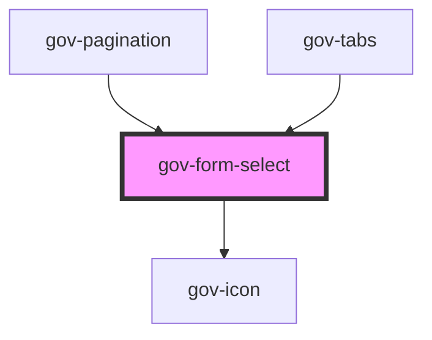

# gov-form-select

<!-- Auto Generated Below -->

## Properties

| Property               | Attribute                | Description                                                                                                                                                                                                                                                                                        | Type                       | Default       |
| ---------------------- | ------------------------ | -------------------------------------------------------------------------------------------------------------------------------------------------------------------------------------------------------------------------------------------------------------------------------------------------- | -------------------------- | ------------- |
| `disabled`             | `disabled`               | Makes the select component disabled. This prevents users from being able to interact with the select, and conveys its inactive state to assistive technologies.                                                                                                                                    | `boolean`                  | `false`       |
| `identifier`           | `identifier`             | Custom select identifier.                                                                                                                                                                                                                                                                          | `string`                   | `undefined`   |
| `invalid`              | `invalid`                | Indicates the entered value does not conform to the format expected by the application.                                                                                                                                                                                                            | `boolean`                  | `undefined`   |
| `name`                 | `name`                   | Name of the select.                                                                                                                                                                                                                                                                                | `string`                   | `undefined`   |
| `required`             | `required`               | Set whether the input is required or not. Please note that this is necessary for accessible inputs when the user is required to fill them. When using this property you need to also set “novalidate” attribute to your form element to prevent browser from displaying its own validation errors. | `boolean`                  | `false`       |
| `size`                 | `size`                   | Select’s size.                                                                                                                                                                                                                                                                                     | `"l" \| "m" \| "xl"`       | `'m'`         |
| `success`              | `success`                | Indicates the entered value of child form element does conform to the format expected by the application.                                                                                                                                                                                          | `boolean`                  | `undefined`   |
| `value`                | `value`                  | Value of select                                                                                                                                                                                                                                                                                    | `string`                   | `undefined`   |
| `variant`              | `variant`                | Style variation of the form select.                                                                                                                                                                                                                                                                | `"primary" \| "secondary"` | `'secondary'` |
| `wcagActiveDescendant` | `wcag-active-descendant` | Indicates the id of a related component’s visually focused element.                                                                                                                                                                                                                                | `string`                   | `undefined`   |
| `wcagControls`         | `wcag-controls`          | Use this prop to add an aria-controls attribute. Use the attribute to indicate the id of a component controlled by this component.                                                                                                                                                                 | `string`                   | `undefined`   |
| `wcagDescribedBy`      | `wcag-described-by`      | Indicates the id of a component that describes the input.                                                                                                                                                                                                                                          | `string`                   | `undefined`   |
| `wcagLabelledBy`       | `wcag-labelled-by`       | Indicates the id of a component that labels the input.                                                                                                                                                                                                                                             | `string`                   | `undefined`   |
| `wcagOwns`             | `wcag-owns`              | Indicates the id of a component that describes the input.                                                                                                                                                                                                                                          | `string`                   | `undefined`   |

## Events

| Event        | Description                           | Type                           |
| ------------ | ------------------------------------- | ------------------------------ |
| `gov-blur`   | Emitted when the select loses focus.  | `CustomEvent<FormSelectEvent>` |
| `gov-change` | Emitted when the select change value. | `CustomEvent<FormSelectEvent>` |
| `gov-focus`  | Emitted when the select has focus.    | `CustomEvent<FormSelectEvent>` |

## Methods

### `getRef() => Promise<HTMLSelectElement>`

Returns an instance of the native html select element

#### Returns

Type: `Promise<HTMLSelectElement>`

### `setFocus(options?: FocusOptions) => Promise<void>`

Returns the current state of the component

#### Parameters

| Name      | Type           | Description |
| --------- | -------------- | ----------- |
| `options` | `FocusOptions` |             |

#### Returns

Type: `Promise<void>`

### `setOptions(options: FormSelectOption[]) => Promise<void>`

Sets the selection options

#### Parameters

| Name      | Type                 | Description |
| --------- | -------------------- | ----------- |
| `options` | `FormSelectOption[]` |             |

#### Returns

Type: `Promise<void>`

### `setValue(value: string) => Promise<void>`

Sets the ordered value of the element

#### Parameters

| Name    | Type     | Description |
| ------- | -------- | ----------- |
| `value` | `string` |             |

#### Returns

Type: `Promise<void>`

### `validateWcag() => Promise<void>`

Validate the WCAG attributes of the component

#### Returns

Type: `Promise<void>`

## Dependencies

### Used by

 - [gov-pagination](../../gov-pagination)
 - [gov-tabs](../../gov-tabs)

### Depends on

- [gov-icon](../../gov-icon)

### Graph

----------------------------------------------

*Built with [StencilJS](https://stenciljs.com/)*
