# gov-icon

<!-- Auto Generated Below -->

## Properties

| Property | Attribute | Description           | Type     | Default   |
| -------- | --------- | --------------------- | -------- | --------- |
| `name`   | `name`    | Name of icon          | `string` | `null`    |
| `type`   | `type`    | Type (folder) of icon | `string` | `"basic"` |

## Dependencies

### Used by

 - [gov-accordion-item](../gov-accordion)
 - [gov-attachments-item](../gov-attachments)
 - [gov-button](../gov-button/button)
 - [gov-card](../gov-card)
 - [gov-chip](../gov-chip)
 - [gov-form-autocomplete](../gov-form/autocomplete)
 - [gov-form-checkbox](../gov-form/checkbox)
 - [gov-form-file](../gov-form/file)
 - [gov-form-input](../gov-form/input)
 - [gov-form-multi-select](../gov-form/multiselect)
 - [gov-form-select](../gov-form/select)
 - [gov-infobar](../gov-infobar)
 - [gov-loading](../gov-loading/loading)
 - [gov-modal](../gov-modal)
 - [gov-pagination](../gov-pagination)
 - [gov-prompt](../gov-promp)
 - [gov-side-nav-item](../gov-side-nav)
 - [gov-tag](../gov-tag)
 - [gov-tile](../gov-tile)
 - [gov-toast](../gov-toast)
 - [gov-tooltip-content](../gov-tooltip)
 - [gov-wizard-item](../gov-wizard)

### Graph

```mermaid
graph TD;
  gov-accordion-item --> gov-icon
  gov-attachments-item --> gov-icon
  gov-button --> gov-icon
  gov-card --> gov-icon
  gov-chip --> gov-icon
  gov-form-autocomplete --> gov-icon
  gov-form-checkbox --> gov-icon
  gov-form-file --> gov-icon
  gov-form-input --> gov-icon
  gov-form-multi-select --> gov-icon
  gov-form-select --> gov-icon
  gov-infobar --> gov-icon
  gov-loading --> gov-icon
  gov-modal --> gov-icon
  gov-pagination --> gov-icon
  gov-prompt --> gov-icon
  gov-side-nav-item --> gov-icon
  gov-tag --> gov-icon
  gov-tile --> gov-icon
  gov-toast --> gov-icon
  gov-tooltip-content --> gov-icon
  gov-wizard-item --> gov-icon
  style gov-icon fill:#f9f,stroke:#333,stroke-width:4px
```

----------------------------------------------

*Built with [StencilJS](https://stenciljs.com/)*
