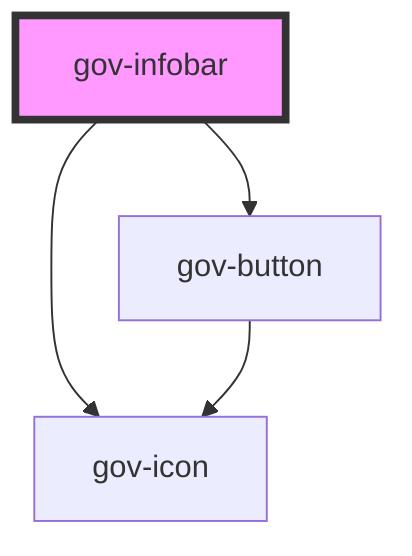

# gov-infobar

<!-- Auto Generated Below -->

## Properties

| Property          | Attribute           | Description                                                                     | Type                                                            | Default                     |
| ----------------- | ------------------- | ------------------------------------------------------------------------------- | --------------------------------------------------------------- | --------------------------- |
| `closable`        | `closable`          | Displays the option to close the infobar                                        | `boolean`                                                       | `false`                     |
| `headline`        | `headline`          | Style variation of the button.                                                  | `string`                                                        | `undefined`                 |
| `inverse`         | `inverse`           | Determine if component should have inverse colors to be used on dark background | `boolean`                                                       | `false`                     |
| `variant`         | `variant`           | Style variation of the button.                                                  | `"error" \| "primary" \| "secondary" \| "success" \| "warning"` | `'primary'`                 |
| `wcagCloseLabel`  | `wcag-close-label`  | Aria label for the closing button. It is mandatory if the infobar is closable   | `string`                                                        | `'Zavřít informační lištu'` |
| `wcagToggleLabel` | `wcag-toggle-label` | Aria label for the toggle button. It is mandatory if the infobar has headline   | `string`                                                        | `'Zobrazit více informací'` |

## Events

| Event       | Description                             | Type                        |
| ----------- | --------------------------------------- | --------------------------- |
| `gov-close` | Called when the close button is clicked | `CustomEvent<InfobarEvent>` |

## Methods

### `validateWcag() => Promise<void>`

Validate the WCAG attributes of the component

#### Returns

Type: `Promise<void>`

## Dependencies

### Depends on

- [gov-button](../gov-button/button)
- [gov-icon](../gov-icon)

### Graph

----------------------------------------------

*Built with [StencilJS](https://stenciljs.com/)*
