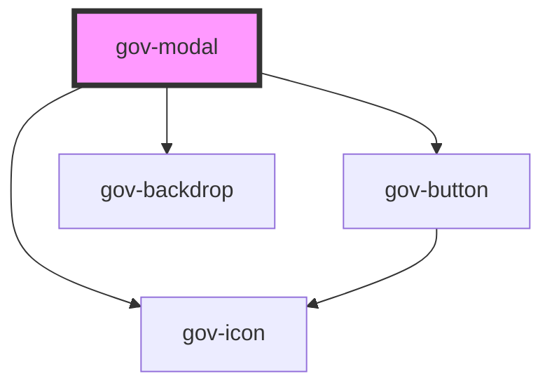

# gov-modal

<!-- Auto Generated Below -->

## Properties

| Property              | Attribute                | Description                                                                                   | Type      | Default         |
| --------------------- | ------------------------ | --------------------------------------------------------------------------------------------- | --------- | --------------- |
| `blockClose`          | `block-close`            | Attribute allowing blocking the modal closing                                                 | `boolean` | `false`         |
| `label`               | `label`                  | Title of modal window                                                                         | `string`  | `undefined`     |
| `labelTag`            | `label-tag`              | Used to change the HTML tag in the modal label for correct semantic structure                 | `string`  | `'h2'`          |
| `open`                | `open`                   | Attribute for modal window display                                                            | `boolean` | `false`         |
| `role`                | `role`                   | Role of modal                                                                                 | `string`  | `'dialog'`      |
| `wcagCloseLabel`      | `wcag-close-label`       | Adds accessible label for the modal close button that is only shown for screen readers.       | `string`  | `'Zavřít okno'` |
| `wcagCloseLabelledBy` | `wcag-close-labelled-by` | A string of identifiers that indicate alternative label elements for closing the modal window | `string`  | `undefined`     |
| `wcagDescribedBy`     | `wcag-described-by`      | Indicates the id of a component that describes the modal.                                     | `string`  | `undefined`     |
| `wcagLabelledBy`      | `wcag-labelled-by`       | String of id's that indicate alternative labels elements                                      | `string`  | `undefined`     |

## Events

| Event       | Description                       | Type                        |
| ----------- | --------------------------------- | --------------------------- |
| `gov-close` | Emitted when modal window closes. | `CustomEvent<PointerEvent>` |

## Methods

### `hide() => Promise<void>`

Hiding the modal

#### Returns

Type: `Promise<void>`

### `show() => Promise<void>`

Showing the modal

#### Returns

Type: `Promise<void>`

### `validateWcag() => Promise<void>`

Validate the WCAG attributes of the component

#### Returns

Type: `Promise<void>`

## Dependencies

### Depends on

- [gov-button](../gov-button/button)
- [gov-icon](../gov-icon)
- [gov-backdrop](../gov-backdrop)

### Graph

----------------------------------------------

*Built with [StencilJS](https://stenciljs.com/)*
