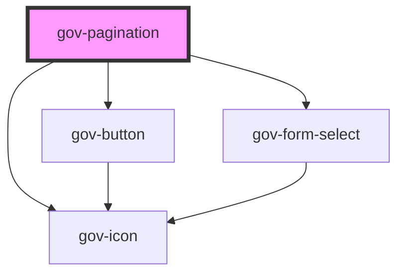

# gov-pagination

<!-- Auto Generated Below -->

## Properties

| Property          | Attribute           | Description                                                                                                                                                                                                                                             | Type                       | Default           |
| ----------------- | ------------------- | ------------------------------------------------------------------------------------------------------------------------------------------------------------------------------------------------------------------------------------------------------- | -------------------------- | ----------------- |
| `current`         | `current`           | Currently displayed page                                                                                                                                                                                                                                | `number`                   | `1`               |
| `inverse`         | `inverse`           | Set on active page                                                                                                                                                                                                                                      | `boolean`                  | `undefined`       |
| `link`            | `link`              | Setting a link to redirect to a given page. The {PAGE} wildcard can be used in the link to replace the page number. Note that in the case of paging through a link, it is always necessary to send to the component the current page where the user is. | `string`                   | `undefined`       |
| `maxPages`        | `max-pages`         | Maximum pages displayed for selection                                                                                                                                                                                                                   | `number`                   | `5`               |
| `pageSize`        | `page-size`         | Maximum number of entries per page                                                                                                                                                                                                                      | `number`                   | `10`              |
| `size`            | `size`              | Pagination's size                                                                                                                                                                                                                                       | `"m" \| "s"`               | `"m"`             |
| `total`           | `total`             | Total count of entries                                                                                                                                                                                                                                  | `number`                   | `0`               |
| `type`            | `type`              | Pagination type                                                                                                                                                                                                                                         | `"button" \| "select"`     | `"button"`        |
| `variant`         | `variant`           | Style variation of the pagination.                                                                                                                                                                                                                      | `"primary" \| "secondary"` | `"primary"`       |
| `wcagLabel`       | `wcag-label`        | Adds accessible label for the pagination that is only shown for screen readers.                                                                                                                                                                         | `string`                   | `undefined`       |
| `wcagLabelledBy`  | `wcag-labelled-by`  | Indicates the id of a component that labels the pagination.                                                                                                                                                                                             | `string`                   | `undefined`       |
| `wcagPageLabel`   | `wcag-page-label`   | Adds accessible label for the page item                                                                                                                                                                                                                 | `string`                   | `"Strana"`        |
| `wcagSelectLabel` | `wcag-select-label` | Adds accessible label for the page select                                                                                                                                                                                                               | `string`                   | `"Vybrat stranu"` |

## Events

| Event      | Description                                                                      | Type                           |
| ---------- | -------------------------------------------------------------------------------- | ------------------------------ |
| `gov-page` | Event called when changing the page with the current setting of the whole paging | `CustomEvent<PaginationEvent>` |

## Methods

### `validateWcag() => Promise<void>`

Validate the WCAG attributes of the component

#### Returns

Type: `Promise<void>`

## Dependencies

### Depends on

- [gov-button](../gov-button/button)
- [gov-icon](../gov-icon)
- [gov-form-select](../gov-form/select)

### Graph

----------------------------------------------

*Built with [StencilJS](https://stenciljs.com/)*
