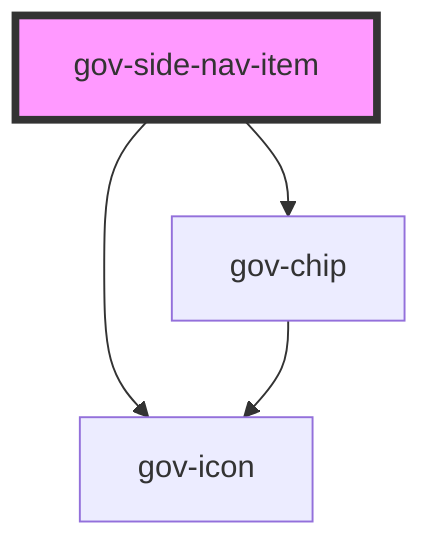

# gov-accordion-item

<!-- Auto Generated Below -->

## Properties

| Property     | Attribute     | Description                                                                                                                                                     | Type      | Default     |
| ------------ | ------------- | --------------------------------------------------------------------------------------------------------------------------------------------------------------- | --------- | ----------- |
| `compact`    | `compact`     | Determide if component should have compact styles.                                                                                                              | `boolean` | `false`     |
| `count`      | `count`       | Defined the count of nested items                                                                                                                               | `boolean` | `false`     |
| `disabled`   | `disabled`    | Makes the button component disabled. This prevents users from being able to interact with the button, and conveys its inactive state to assistive technologies. | `boolean` | `false`     |
| `href`       | `href`        | Same as original parameter                                                                                                                                      | `string`  | `undefined` |
| `identifier` | `identifier`  | Custom sidenav item identifier. Otherwise, it will be generated                                                                                                 | `string`  | `undefined` |
| `inverse`    | `inverse`     | Determide if component should have inversed colors to be used on dark background                                                                                | `boolean` | `false`     |
| `isExpanded` | `is-expanded` | Defines whether the sidenav is open or closed by button                                                                                                         | `boolean` | `false`     |
| `label`      | `label`       | Item name of the sidenav                                                                                                                                        | `string`  | `undefined` |

## Events

| Event        | Description                           | Type                                     |
| ------------ | ------------------------------------- | ---------------------------------------- |
| `gov-change` | Called when the sidenav state changes | `CustomEvent<GovSideNavItemChangeEvent>` |

## Methods

### `close() => Promise<void>`

Closing the sidenav

#### Returns

Type: `Promise<void>`

### `currentState() => Promise<boolean>`

Returns the current state of the component

#### Returns

Type: `Promise<boolean>`

### `open() => Promise<void>`

Opening the sidenav

#### Returns

Type: `Promise<void>`

### `toggle() => Promise<void>`

sidenav switch

#### Returns

Type: `Promise<void>`

## Dependencies

### Depends on

- [gov-chip](../gov-chip)
- [gov-icon](../gov-icon)

### Graph

----------------------------------------------

*Built with [StencilJS](https://stenciljs.com/)*
