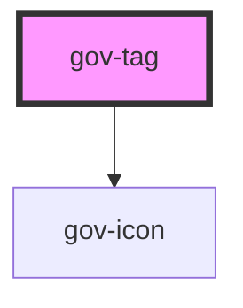

# gov-tag

<!-- Auto Generated Below -->

## Properties

| Property    | Attribute    | Description                                                                                  | Type                                                            | Default                  |
| ----------- | ------------ | -------------------------------------------------------------------------------------------- | --------------------------------------------------------------- | ------------------------ |
| `iconLeft`  | `icon-left`  | Definition of the button icon on the left. The icon must be defined in the form "type/name". | `string`                                                        | `undefined`              |
| `iconRight` | `icon-right` | Definition of the button icon on the left. The icon must be defined in the form "type/name". | `string`                                                        | `undefined`              |
| `inverse`   | `inverse`    | Determine if component should have inverse colors to be used on dark background              | `boolean`                                                       | `false`                  |
| `size`      | `size`       | Tag’s size.                                                                                  | `"l" \| "m" \| "s" \| "xl" \| "xs"`                             | `ButtonSizes._S`         |
| `variant`   | `variant`    | Style variation of the tag.                                                                  | `"error" \| "primary" \| "secondary" \| "success" \| "warning"` | `ButtonVariants.PRIMARY` |

## Dependencies

### Depends on

- [gov-icon](../gov-icon)

### Graph

----------------------------------------------

*Built with [StencilJS](https://stenciljs.com/)*
