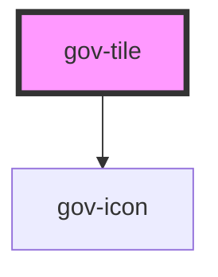

# gov-tile

<!-- Auto Generated Below -->

## Properties

| Property | Attribute | Description                | Type                            | Default     |
| -------- | --------- | -------------------------- | ------------------------------- | ----------- |
| `href`   | `href`    | Link on whole tile         | `string`                        | `undefined` |
| `target` | `target`  | Same as original parameter | `"_blank" \| "_new" \| "_self"` | `undefined` |

## Methods

### `getTriggerRef() => Promise<HTMLLinkElement | HTMLSpanElement>`

Returns a clickable element instance

#### Returns

Type: `Promise<HTMLLinkElement | HTMLSpanElement>`

## Dependencies

### Depends on

- [gov-icon](../gov-icon)

### Graph

----------------------------------------------

*Built with [StencilJS](https://stenciljs.com/)*
