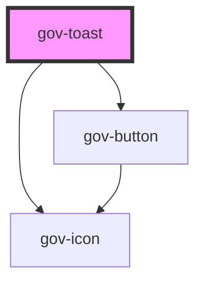

# gov-toast

<!-- Auto Generated Below -->

## Properties

| Property         | Attribute          | Description                                                                 | Type                                                            | Default     |
| ---------------- | ------------------ | --------------------------------------------------------------------------- | --------------------------------------------------------------- | ----------- |
| `closeLabel`     | `close-label`      | Closing button texting instead of icons                                     | `string`                                                        | `undefined` |
| `gravity`        | `gravity`          | Toast’s gravity                                                             | `"bottom" \| "top"`                                             | `"top"`     |
| `position`       | `position`         | Toast’s position                                                            | `"center" \| "left" \| "right"`                                 | `"right"`   |
| `time`           | `time`             | Number of milliseconds to wait before Toast disappear                       | `number`                                                        | `0`         |
| `type`           | `type`             | Toast type                                                                  | `"classic" \| "solid"`                                          | `"classic"` |
| `variant`        | `variant`          | Style variation of the toast message.                                       | `"error" \| "primary" \| "secondary" \| "success" \| "warning"` | `"primary"` |
| `wcagCloseLabel` | `wcag-close-label` | Aria label for the closing button. It is mandatory if the alert is closable | `string`                                                        | `undefined` |

## Events

| Event       | Description                             | Type                  |
| ----------- | --------------------------------------- | --------------------- |
| `gov-close` | Called when the close button is clicked | `CustomEvent<string>` |

## Methods

### `destroy() => Promise<void>`

Remove toast from dom

#### Returns

Type: `Promise<void>`

## Dependencies

### Depends on

- [gov-button](../gov-button/button)
- [gov-icon](../gov-icon)

### Graph

----------------------------------------------

*Built with [StencilJS](https://stenciljs.com/)*
