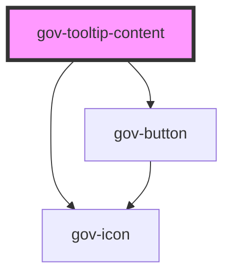

# gov-tooltip-content

<!-- Auto Generated Below -->

## Properties

| Property    | Attribute    | Description                          | Type                       | Default                  |
| ----------- | ------------ | ------------------------------------ | -------------------------- | ------------------------ |
| `isVisible` | `is-visible` | Indicates display of tooltip content | `boolean`                  | `false`                  |
| `parentId`  | `parent-id`  | Indicates display of tooltip content | `string`                   | `null`                   |
| `persist`   | `persist`    | Tooltip is still visible.            | `boolean`                  | `false`                  |
| `size`      | `size`       | Tooltip’s size.                      | `"l" \| "m" \| "s"`        | `TooltipSize._M`         |
| `variant`   | `variant`    | Style variation of the tooltip       | `"primary" \| "secondary"` | `TooltipVariant.PRIMARY` |

## Dependencies

### Depends on

- [gov-button](../gov-button/button)
- [gov-icon](../gov-icon)

### Graph

----------------------------------------------

*Built with [StencilJS](https://stenciljs.com/)*
