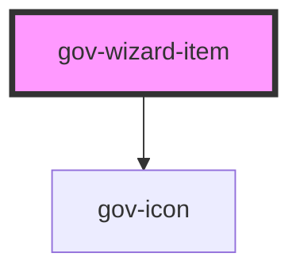

# gov-wizard

<!-- Auto Generated Below -->

## Properties

| Property      | Attribute     | Description                                                                         | Type                                                            | Default     |
| ------------- | ------------- | ----------------------------------------------------------------------------------- | --------------------------------------------------------------- | ----------- |
| `annotation`  | `annotation`  | Item annotation of the wizard                                                       | `string`                                                        | `undefined` |
| `collapsible` | `collapsible` | Defines weather the wizard item can be collapsible                                  | `boolean`                                                       | `false`     |
| `disabled`    | `disabled`    | Makes the wizard component disabled.                                                | `boolean`                                                       | `false`     |
| `identifier`  | `identifier`  | Custom wizard item identifier. Otherwise, it will be generated                      | `string`                                                        | `undefined` |
| `isExpanded`  | `is-expanded` | Defines whether the accordion is open or closed by button                           | `boolean`                                                       | `false`     |
| `label`       | `label`       | Item label of the wizard                                                            | `string`                                                        | `undefined` |
| `labelTag`    | `label-tag`   | Used to change the HTML tag in the accordion trigger for correct semantic structure | `string`                                                        | `"h3"`      |
| `size`        | `size`        | Size of wizard                                                                      | `"m" \| "s" \| "xs"`                                            | `"m"`       |
| `variant`     | `variant`     | Style variation of the button.                                                      | `"error" \| "primary" \| "secondary" \| "success" \| "warning"` | `"primary"` |

## Events

| Event        | Description                             | Type                           |
| ------------ | --------------------------------------- | ------------------------------ |
| `gov-change` | Called when the accordion state changes | `CustomEvent<WizardItemEvent>` |

## Methods

### `close() => Promise<void>`

Closing the Wizard

#### Returns

Type: `Promise<void>`

### `currentState() => Promise<boolean>`

Returns the current state of the component

#### Returns

Type: `Promise<boolean>`

### `open() => Promise<void>`

Opening the Wizard

#### Returns

Type: `Promise<void>`

### `toggle() => Promise<void>`

Wizard switch

#### Returns

Type: `Promise<void>`

## Dependencies

### Depends on

- [gov-icon](../gov-icon)

### Graph

----------------------------------------------

*Built with [StencilJS](https://stenciljs.com/)*
